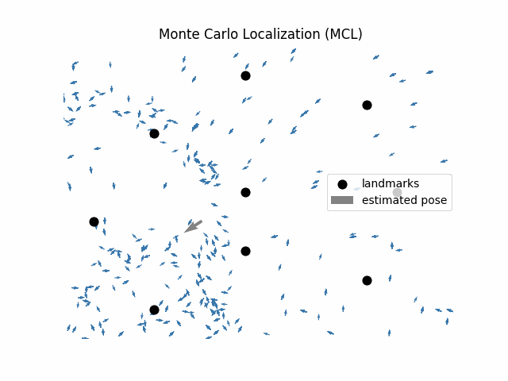

# Monte Carlo Localization (MCL)

**Monte Carlo Localization** from scratch in less than **200** lines of code. The code utilizes a probabilistic odometry motion model and a landmark sensor model, which models both the range and the bearing information. The entire code (including visualization) is available [here](./mcl.py).

## Demo



## Data

To run the code you must provide a path to the following two files:

### 1. World Description

Text file, with columns in the following order: `landmark_id, landmark_x, landmark_y`.
```
1 2 1
2 0 4
...
```

### 2. Sensor Data

Text file containing odometry and sensor measurements. 

```
ODOMETRY 0.100068080139 0.100249642432 -0.000326992241362
SENSOR 1 2.08219220544 0.311724182123
SENSOR 2 4.01188450412 1.44126366316
ODOMETRY 0.100770135385 0.0999830371692 0.000283319078732
SENSOR 1 2.03292033382 0.309629930574
SENSOR 2 3.67779686283 1.3616405663
...
```

The odometry measurements have columns in the following order: `ODOMETRY, delta_rot1, delta_trans, delta_rot2`.
The sensor measurements have columns in the following order: `SENSOR, landmark_id, range, bearing`.

## References

1. [IMR, Albert-Ludwigs-Universität Freiburg](http://ais.informatik.uni-freiburg.de/teaching/ss21/robotics/)